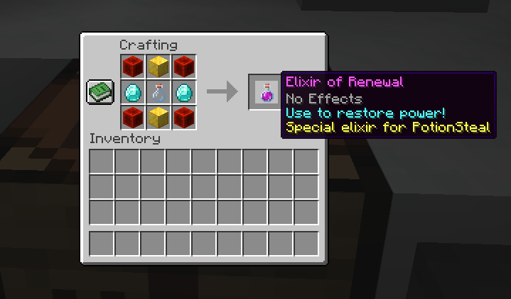
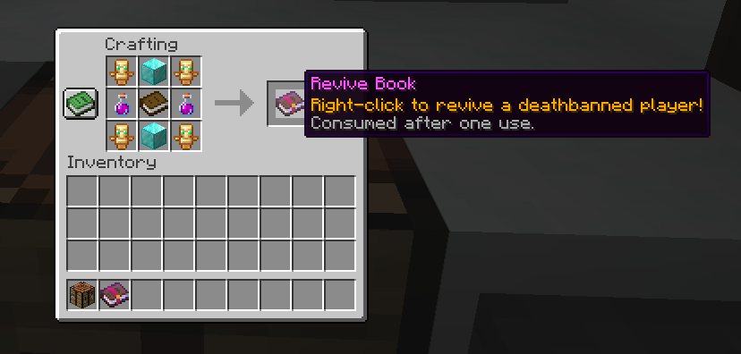

# PotionSteal

**PotionSteal** is a powerful, flexible [PaperMC](https://papermc.io/) plugin inspired by LifeSteal, but with a twist: instead of hearts, it uses potion effects and a balance system to define player "power"! Players can craft custom elixirs and revive books, revive banned friends through a unique GUI, and enjoy a fully configurable experience.

---

## Features

- **Balance System:** Every player has a "balance" that can be lost, gained, or set by commands.
- **Deathban:** When a player's balance reaches zero, they are temporarily banned ("deathbanned").
- **Custom Elixir Item:** A unique potion item that can be crafted or given via command to regain balance or remove negative effects. The appearance and type of this Elixir is **hardcoded** for consistency.
- **Revive Book:** Craftable item that allows any player to revive a deathbanned player via an interactive GUI—consumed after use! Only the custom Elixir is accepted in the recipe.
- **Admin Tools:** Powerful commands to manage balances, immunity, revive players, reload config, and give special items.
- **Custom Tablist:** Show player balances in the tablist (fully customizable).
- **Highly Configurable:** Most plugin settings are easily modified in `config.yml`, except for the Elixir appearance and properties, which are hardcoded for consistency.

---

## Usage

### Commands

| Command                                      | Permission             | Description                                      |
|----------------------------------------------|------------------------|--------------------------------------------------|
| `/potionsteal balance [player]`              | potionsteal.balance    | View your or another player's balance            |
| `/potionsteal setbalance <player> <value>`   | potionsteal.admin      | Set a player's balance                           |
| `/potionsteal giveelixir <player> [amount]`  | potionsteal.admin      | Give elixir(s) to a player                       |
| `/potionsteal immunity <player> <on/off>`    | potionsteal.admin      | Toggle deathban immunity for a player            |
| `/potionsteal reload`                        | potionsteal.admin      | Reloads the plugin config                        |
| `/potionsteal revive <player>`               | potionsteal.admin      | Revive (unban) a deathbanned player              |
| `/potionsteal giverevivebook <player> [amt]` | potionsteal.admin      | Give Revive Book(s) to a player                  |

> Note: The reload command is buggy, and not working, so you will have to restart the server to see changes done in config.yml

---

## Recipes

### Elixir

The Elixir is a custom potion, required to craft Revive Books and recover power.

<!-- Place your Elixir recipe screenshot below -->

---

### Revive Book

The Revive Book lets **any player** revive a deathbanned player via a GUI. It is consumed after one use.

> Note: The potion that you see in the recipe is the Elixir of Renewal

---

## Editing Settings

All general settings can be found in the `config.yml` file.

- **enabled:** Set to `false` to disable the entire plugin.
- **pluginDisplayName:** Changes how the plugin name appears in logs and messages.
- **balance.default:** Default starting balance for new players.
- **tablist:** Toggle and format the custom tablist display.

---

## License

This project is open-source and available under the [MIT License](LICENSE).

---